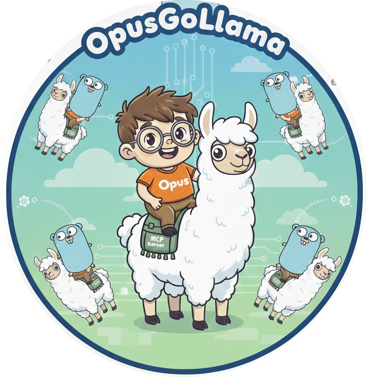

<p align="center">
  
</p>

# OpusGoLlama

**Opus thinks, Go orchestrates, Llamas work.**

An MCP server that lets Claude Opus delegate work to locally-running Ollama models. A Go server sits between them and handles everything that isn't a language problem — like reading/writing files, managing a concurrent worker pool, and cleaning up memory. Opus decides what to delegate and writes the prompts. Go moves the bytes. The local models just transform text.

Built with:
- **[Official MCP Go SDK](https://github.com/modelcontextprotocol/go-sdk)** (`github.com/modelcontextprotocol/go-sdk`) — the Anthropic/Google-maintained SDK for building MCP servers and clients in Go
- **[Official Ollama Go Client](https://github.com/ollama/ollama)** (`github.com/ollama/ollama/api`) — the Ollama team's own Go API client

## What This Does

This is an MCP (Model Context Protocol) server that runs as a subprocess of Claude Code. When you start a Claude Code session, Claude Code spawns this server automatically. The Go server handles all the infrastructure between Claude and your local Ollama models — file I/O, concurrency, text processing, process execution, memory management, and error reporting — so neither model wastes intelligence on work that isn't a language problem.

The server is **generic** — it doesn't hard-code any specific task type. Claude defines what the workers should do by writing the system prompt and user prompt for each task. The same server handles refactoring, summarization, code generation, or anything else you can describe in a prompt.

### Design: Three Layers, Zero Wasted Work

Without this server, you have two options. Either Claude does everything — reads files, transforms code, writes files, runs formatters — burning expensive cloud tokens on mechanical work. Or you prompt a local model to do its own file I/O, hoping a 14B model gets paths, permissions, and shell commands right across 200 tasks.

Both approaches waste model intelligence on work that isn't a language problem. File I/O, concurrency, text processing, process management — these are **software problems**, and Go is purpose-built for them.

This project adds Go as a middle layer that handles everything between the two models:

```
┌─────────────────────────────────────────────────────────────────┐
│                      CLAUDE OPUS (cloud)                        │
│                                                                 │
│   Planning · Prompt writing · Quality judgment · Orchestration  │
│                                                                 │
│   "Which files need to change? What should I tell the worker?   │
│    Did the output look right? What failed and why?"             │
├─────────────────────────────────────────────────────────────────┤
│                      GO SERVER (local)                          │
│                                                                 │
│   File I/O · Concurrency · Fence stripping · Formatting        │
│   Task queue · Memory management · Error reporting              │
│                                                                 │
│   "Read this file. Write that file. Run gofmt. Manage 200      │
│    tasks across 3 worker slots. Free memory when done."         │
├─────────────────────────────────────────────────────────────────┤
│                      OLLAMA MODEL (local)                       │
│                                                                 │
│   Text transformation — nothing else                            │
│                                                                 │
│   "Given this code and these instructions, return the           │
│    modified code."                                              │
└─────────────────────────────────────────────────────────────────┘
```

**What Go handles** — and why it matters:

- **File I/O**: Reads input files, writes output files. Deterministic, instant, never fails because a model hallucinated a path. File contents flow between disk and Ollama without ever touching either model's context window.
- **Concurrency**: Manages a semaphore-bounded worker pool — 200 tasks across 3 GPU slots, with goroutines queuing, executing, and cleaning up. This is what Go was designed for.
- **Text processing**: Strips markdown code fences before writing (LLMs love wrapping code in ` ``` `). A simple string operation that would cost inference tokens if done by a model.
- **Process execution**: Runs formatters (`gofmt`, `prettier`) after each file write with timeouts and error capture. Shell execution with proper cleanup — trivial in Go, unreliable when prompted through a model.
- **Memory lifecycle**: Clears completed results from memory when they've been written to disk. Cleans up input fields after terminal states. Over 200 tasks, this is the difference between steady memory and unbounded growth.
- **Error reporting**: Every failure — file not found, write permission denied, formatter crashed, Ollama timeout — produces a specific, actionable error message. No guessing why task 147 failed.

The result: **Claude only thinks.** It decides what needs to change, writes the prompts, monitors quality, and handles failures — all judgment work. **Go only executes.** It moves bytes, manages concurrency, and runs processes — all deterministic work. **The local model only transforms text.** It gets clean input and returns clean output — the one thing it's actually good at.

No component is asked to do work that another component does better.

### File I/O Pipeline

Claude submits tasks with `input_file` and `output_file` paths. The Go server reads the file, sends it to Ollama, strips markdown code fences (configurable), writes the result to disk, and optionally runs a formatter via `post_write_cmd`. The result is then cleared from memory. No reading files into context, no retrieving results, no writing files back — all handled server-side.

### Built-in Intelligence

The server ships with opinionated instructions that are sent to Claude during MCP initialization (via the SDK's `ServerOptions.Instructions` field). You can read and modify them in [`serverInstructions.go`](serverInstructions.go). These teach Claude how to use the tools effectively without any additional configuration. The instructions cover seven areas:

- **How this server works** — explains the Go server's role: file I/O, concurrency management, text processing, formatter execution, memory lifecycle, and error reporting. Gives Claude the architectural context to debug failures, advise the user, and understand that file contents never enter its context window.
- **Session startup** — call `list_models` to discover available models; pick the smallest model that can handle each task; start with smaller models in pilot batches
- **When to delegate** — proactively hand off mechanical, repetitive tasks; fan out per-file summarization for codebase understanding; keep architectural decisions and cross-file reasoning for itself
- **File I/O pipeline** — use `input_file`/`output_file` for zero-context-cost file transforms; let `strip_markdown_fences` handle code fence cleanup; use `post_write_cmd` for formatters
- **Structuring prompts** — treat workers as literal junior developers; include before/after examples; one concern per task; respect model context windows
- **Submitting work** — always pilot 2-3 tasks before full batches; tag every batch; prefer many small tasks over fewer large ones
- **Monitoring** — poll with `check_tasks` (lightweight); spot-check output files mid-batch; investigate every failure; validate results when possible

These instructions are opinionated by design. The local workers are less sophisticated models — the instructions ensure Claude treats them accordingly: explicit instructions, mechanical tasks, clear success criteria, and active quality control.

### Examples

#### Fire-and-forget file transformation

You have 200 Go files that need a mechanical refactoring. Claude submits them all at once:

```
submit_tasks({tasks: [{
  system_prompt: "You are a Go refactoring worker. Return ONLY the modified file.",
  prompt: "Add context.Context as the first parameter to every exported function.",
  input_file: "/abs/path/to/handler.go",
  output_file: "/abs/path/to/handler.go",
  post_write_cmd: "gofmt -w /abs/path/to/handler.go",
  tag: "add_ctx_batch1"
}, ...]})
```

The server reads each file, sends it to Ollama, strips markdown fences, writes the result back, and runs `gofmt`. Claude never sees the file contents — it just monitors progress with `check_tasks` and spot-checks a few output files.

#### Single-file delegation (Go)

You have a large `types.go` with 40 structs that are missing JSON and YAML struct tags. You mention it to Opus while asking it to build out an API endpoint. Opus reads the file, recognizes this is mechanical work, and hands it off:

1. Opus calls `submit_tasks` with `input_file` pointing to `types.go` and `output_file` pointing back to the same path
2. Opus includes a before/after example of one struct in the prompt
3. The local model returns the tagged file in a few seconds — no cloud round-trip, no waiting
4. `gofmt` runs automatically via `post_write_cmd`
5. Opus continues with the work that actually needs its judgment

Opus didn't need to do this itself. Tagging 40 structs is tedious and mechanical — exactly the kind of task where a fast local model shines.

#### Codebase understanding

You point Opus at an unfamiliar repo with 80 source files and ask it to explain the architecture. Instead of reading every file into its own context window, Opus uses the workers as a parallel reading layer:

1. Opus calls `submit_tasks` with all 80 files using `input_file` for each, each with the same prompt: "Summarize this file in 3-5 bullet points: its purpose, key exports, and dependencies on other files in the project."
2. Workers process the files in parallel — much faster than Opus reading them sequentially
3. Opus retrieves the summaries (a fraction of the size of the original files) and now has a birds-eye view of the entire codebase
4. Opus reasons over the summaries to explain the architecture, identify patterns, and answer your questions

The workers don't need to understand how the files relate to each other — that's Opus's job. Each worker just summarizes one file, which even a 7B model can do well. Opus gets the big picture without burning its context on 80 full files.

#### When Opus keeps the work

Not everything gets delegated. If you ask Opus to redesign a module's architecture, debug a subtle race condition, or make a judgment call about which approach is better — Opus does that itself. The server instructions teach Opus to only delegate tasks that are mechanical and well-defined. If a task requires reasoning, cross-file understanding, or creativity, Opus handles it directly.

## Prerequisites

### 1. Go

You need Go installed to build the server. This project was developed with Go 1.25.7.

### 2. Ollama

You need [Ollama](https://ollama.com) installed and running on your machine. Ollama serves local LLM models.

**Install Ollama:**
- macOS: `brew install ollama` or download from https://ollama.com/download
- Linux: `curl -fsSL https://ollama.ai/install.sh | sh`

**Start Ollama:**
```bash
ollama serve
```

Ollama runs on `http://127.0.0.1:11434` by default. You can verify it's running:
```bash
curl http://127.0.0.1:11434
# Should return: "Ollama is running"
```

**Pull a model:**
```bash
ollama pull qwen2.5-coder:14b
```

This downloads the default model used by the server (~8-10 GB). You can use any model Ollama supports — just specify it in the task's `model` field, or set the `DEFAULT_MODEL` environment variable.

**Important:** Ollama must be running before you start a Claude Code session that uses this server. The server creates an Ollama client on startup and makes its first connection when Claude calls `list_models`.

### 3. Claude Code

You need [Claude Code](https://docs.anthropic.com/en/docs/claude-code) installed.

## Setup

### Build the Server

```bash
git clone <this-repo>
cd OpusGoLlama
go build .
```

This produces the `OpusGoLlama` binary.

**Note:** The server instructions in [`serverInstructions.go`](serverInstructions.go) are compiled into the binary. If you customize the instructions or make any other code changes, you need to rebuild:

```bash
go build .
```

### Configure Claude Code

Register the MCP server so Claude Code knows to spawn it. You have three options depending on scope:

#### Option A: Global (all projects) — recommended

```bash
claude mcp add --transport stdio --scope user OpusGoLlama -- /absolute/path/to/OpusGoLlama
```

This writes to `~/.claude.json` and makes the server available in every Claude Code session regardless of which project you're in. You only need to run it once.

To pass environment variables:

```bash
claude mcp add --transport stdio --scope user \
  -e WORKER_CONCURRENCY=2 \
  -e DEFAULT_MODEL=llama3.1:8b \
  -e OLLAMA_HOST=http://127.0.0.1:11434 \
  OpusGoLlama -- /absolute/path/to/OpusGoLlama
```

#### Option B: Single project

```bash
claude mcp add --transport stdio OpusGoLlama -- /absolute/path/to/OpusGoLlama
```

This creates (or updates) a `.mcp.json` file in your current project directory. The server is only available when Claude Code is running in that project. Useful if you want to limit which projects have access, or if you want the config checked into version control.

#### Option C: Manual `.mcp.json`

Create a `.mcp.json` file in your project root:

```json
{
  "mcpServers": {
    "OpusGoLlama": {
      "command": "/absolute/path/to/OpusGoLlama",
      "env": {
        "WORKER_CONCURRENCY": "2",
        "DEFAULT_MODEL": "llama3.1:8b",
        "OLLAMA_HOST": "http://127.0.0.1:11434"
      }
    }
  }
}
```

The `env` block is optional — only include it if you want to override defaults.

#### Verify

After adding, restart Claude Code (or start a new session). You can confirm the server is registered:

```bash
claude mcp list
```

You can also ask Claude directly in a session: **"What MCPs do you see?"** — it should list OpusGoLlama and its five tools.

### That's It

There is nothing else to set up. Each time you start a new Claude Code session, Claude Code automatically spawns the server process. When the session ends, the process is stopped. There's no daemon, no database, no configuration files to manage beyond the one-time setup above.

## Tools

The server exposes five tools to Claude:

### `list_models`

Queries Ollama for all available models. Returns the model name, parameter size (e.g. "14B"), quantization level (e.g. "Q4_K_M"), and model family (e.g. "qwen2"). Claude calls this at the start of each session to understand what's available and calibrate its expectations for worker capability.

### `submit_tasks`

Submit a batch of tasks for Ollama to process. Returns task IDs immediately; work happens in the background.

Each task includes:
- `system_prompt` (required) — the persona/instructions for the Ollama model
- `prompt` (required) — the main instruction or question
- `input_file` (optional) — absolute path to a file whose contents are read and appended to the prompt. The server reads the file directly so contents never enter Claude's context window.
- `output_file` (optional) — absolute path where the worker's response will be written. When set, the result is written to disk and cleared from memory.
- `strip_markdown_fences` (optional, default: `true`) — strip markdown code fences from the output before writing to `output_file`. Most LLMs wrap code in fences; this removes them automatically.
- `post_write_cmd` (optional) — shell command to run after writing `output_file` (30s timeout). Use for formatters like `gofmt -w` or `prettier --write`.
- `model` (optional) — which Ollama model to use (default: `qwen2.5-coder:14b`)
- `tag` (optional) — a label for grouping tasks (e.g. `"refactor_batch_1"`)
- `response_hint` (optional) — tells Claude what kind of result to expect: `"status_only"`, `"content"`, or `"json"`
- `timeout_seconds` (optional) — per-task timeout in seconds (default: 600). Increase for large inputs or complex generation

### `check_tasks`

Lightweight status poll. Returns a compact summary like:

```json
{
  "summary": {"total": 100, "pending": 38, "running": 2, "completed": 57, "failed": 3},
  "tasks": [{"id": "...", "status": "completed", "output_file": "/path/to/out.go"}, ...]
}
```

No full result content is returned — this keeps Claude's context window lean. Can filter by `tag` or specific `task_ids`. Tasks with `output_file` show the path in their status.

### `get_result`

Retrieve the full Ollama response for specific tasks. Claude calls this selectively — e.g. to spot-check results or investigate failures. Takes a list of `task_ids`. Note: tasks with `output_file` have their result written to disk — content will be empty but `output_file` path is returned.

### `cancel_tasks`

Cancel pending or running tasks. Can cancel by specific `task_ids`, by `tag`, or cancel everything (empty args).

## Configuration

All configuration is via environment variables, passed with `-e` flags when using `claude mcp add` or in the `env` block of `.mcp.json` (see setup above):

| Variable | Default | Description |
|---|---|---|
| `OLLAMA_HOST` | `http://127.0.0.1:11434` | Ollama API address. Only change this if Ollama is running on a different port or machine. |
| `WORKER_CONCURRENCY` | `2` | Max number of parallel Ollama requests. Bounded by your GPU memory — a 14B model on a 36GB M3 Pro handles 2 comfortably. |
| `DEFAULT_MODEL` | `qwen2.5-coder:14b` | Fallback model when tasks don't specify one. Must already be pulled in Ollama (`ollama pull <model>`). |
| `TASK_TIMEOUT` | `600` | Default per-task timeout in seconds (10 minutes). Claude can override this per-task via `timeout_seconds` in `submit_tasks`. |

## Project Structure

```
main.go                — Server entrypoint. Wires up the store, pool, and tools.
serverInstructions.go  — Opinionated instructions sent to Claude during MCP init.
task.go                — Internal Task struct (lifecycle, fields, status).
task_spec.go           — submit_tasks input types (TaskSpec, SubmitTasksArgs).
task_result.go         — get_result types (TaskResult, GetResultOutput).
task_summary.go        — check_tasks types (TaskSummary, TaskStatus).
cancel_tasks.go        — cancel_tasks types (CancelTasksArgs, CancelTasksOutput).
model_info.go          — list_models types (ModelInfo, ListModelsOutput).
task_store.go          — Thread-safe in-memory task store.
worker_pool.go         — Worker pool with semaphore-bounded Ollama calls + file I/O pipeline.
tool_handlers.go       — MCP tool handler functions (list_models, submit, check, get, cancel).
task_store_test.go     — Store tests: state transitions, guards, memory cleanup, filtering.
worker_pool_test.go    — Worker tests: lifecycle, cancellation, file I/O, fences, post-write.
tool_handlers_test.go  — Handler tests: all 5 tools, validation, defaults, edge cases.
```

## Architecture

```
Claude Code (Opus)
    │
    │ MCP protocol (stdin/stdout, JSON-RPC)
    │
    ▼
┌───────────────────┐
│    Go Server      │──── read input_file ────▶ Local Filesystem
│                   │◀─── write output_file ───
│  task queue       │──── run post_write_cmd ──▶
│  concurrency mgmt │
│  fence stripping  │
│  memory mgmt      │
└───────────────────┘
    │
    │ Ollama Chat API (HTTP, localhost)
    │
    ▼
┌───────────────────┐
│    Ollama         │  text in ──▶ text out
│    (local GPU)    │  (that's it)
└───────────────────┘
```

Task lifecycle:

```
pending  ──▶  running  ──▶  completed
  │              │
  ▼              ▼
cancelled      failed
```

## Testing

99 tests with full race detection coverage:

```bash
go test -race -count=1 ./...
```

Tests use a mock `OllamaClient` interface — no running Ollama instance required. Coverage includes the full worker pipeline (file read, Ollama call, fence stripping, file write, post-write command), all store state transitions and guards, every MCP tool handler, concurrency bounds, cancellation variants, shutdown behavior, and environment variable parsing.
